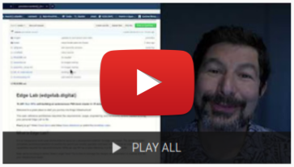

Edge Lab Bring Up - RPi Version
==================

Return to [Edge Lab Overview](README.md) or [Assembly](assembly.md).

This page explains how to build and install the Edge Lab.  Before starting, please acquire all the required items from the [Edge Lab Bill of Materials](bill_of_materials.md).

**Follow [assembly steps](assembly.md) first!**

Video Tutorials (35 min)
-----

[Video Channel](https://youtu.be/Zb6_HRZxsIo) includes multiple install patterns and a complete k3s install.

Bootstrapping
-----------------
You will only need the USB Keyboard and HDMI monitor during the initial bootstrap.

1. Confirm the [Server SD Card](https://s3-us-west-2.amazonaws.com/get.rebar.digital/edge-lab/rpi-server-v1.2.0.img.xz) is in RPi #0 (with the keyboard and hdmi connectors).
2. Confirm the [Client SD Cards](https://s3-us-west-2.amazonaws.com/get.rebar.digital/edge-lab/rpi-client-v1.0.0.img.xz) are inthe other RPi systems.
   1. If you only have one SD Card then you'll need to power the systems on one at a time after each one has been registered with Digital Rebar.
1. Power on the systems including both the Network Switch and all RPis.
   1.  The red lights should be on for all RPis.  The green lights will flash.
1. Wait for the systems to flash their BIOS and reboot.
   1. This may take several minutes for the initial bring up.  During
   2. During this time, the instructions on the SD Cards updating the BIOS and setting the systems to 64bit mode.
   3. There may not be any HDMI output during much of this initial process.
1. Get a command Prompt (two options)
     1. Credentials are root/r0cketsk8ts
     1. Via Monitor & Keyboard:
        1.When the HDMI monitor shows a login prompt, login
     1. Via IP Network:
        1. Attach a wired network connection from your client to the switch
        1. Configure your system to have a static IP (e.g.: 10.3.14.2 subnet 255.255.255.0)
        1. Ping test until the system is available
        1. On switch network, SSH to root@10.3.14.1
1. Run the start-up script on the host with your Wifi information.
   1. The command is `./start-up [Wifi SSID] [Wifi Password]`
   1. It's normal for the initial command to show "cannot connect" while the Wifi is configured
   1. If the command fails, simply try a second or third time.  Script success will show API JSON responses from DRP.
   1. At the end of the process, the Wifi IP address of RPi #0 will be shown
1. Use the Wifi IP address to access Digital Rebar running on RPi #0
   1. visit `https://[RPi #0 Address]:8092` to access Digital Rebar
   1. accept the self-signed SSL certificate
   1. you will be redirected to https://portal.rackn.io/ with the address of your local system already registered
   1. The RackN portal is connecting LOCALLY to RPi #0 via the Wifi network
   1. The other RPis will automatically PXE boot and register to Digital Rebar.
   1. Watch for machine registration from the "Machines" page
1. Allow Self-Boostrap to Finish
   1. Automatically downloads discovery o/s
   1. Automatically sets DRP configuration
   1. Automatically creates Edge Lab Subnet with specialized RPi values
   1. Automatically generates an keypair for access to the other RPis and installs it in global profile
   1. Automatically locks the machine in DRP to prevent accidental changes
1. Suggestioned step: Install your public key in Digital Rebar
      1. Shortcut: use the "Add Key" button under "Info & Preferences" to have the public key automatically installed during machine discovery.
      2. See [Add SSH Keys](https://provision.readthedocs.io/en/latest/doc/faq-troubleshooting.html#add-ssh-keys-to-authorized-keys) in the [Digital Rebar Documentation](https://provision.readthedocs.io)

Bootstrapping is complete!

Fast Reset: Clients run In-Memory O/S
-------------------------

The non-server RPis are running in-memory operating systems so no configuration is saved to the local system.  You can reset the entire environment by:
1. Software API: running the `edgelab-reboot-to-discover` workflow on machines to reboot
1. Mechanical: resetting physical power on the clients.

Depending on your development approach, you may want to also delete the associated machines, profiles and reservations from Digital Rebar.

Kubernetes (k3s) Install
-------------------

RackN [Digital Rebar Edge Lab Content]( https://provision.readthedocs.io/en/latest/doc/content-packages/edge-lab.html) includes simple instructions for installing k3s into your Edge Lab cluster.
